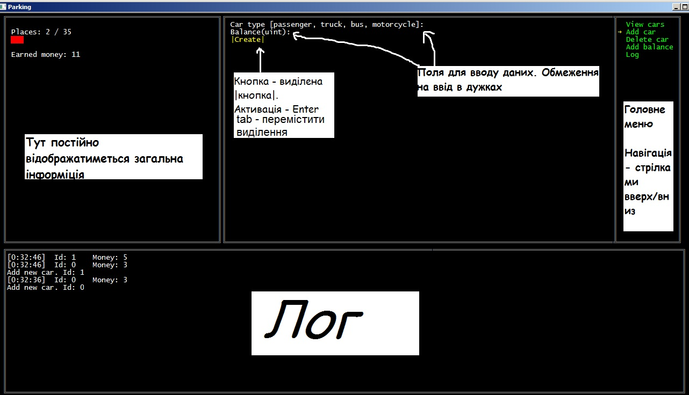
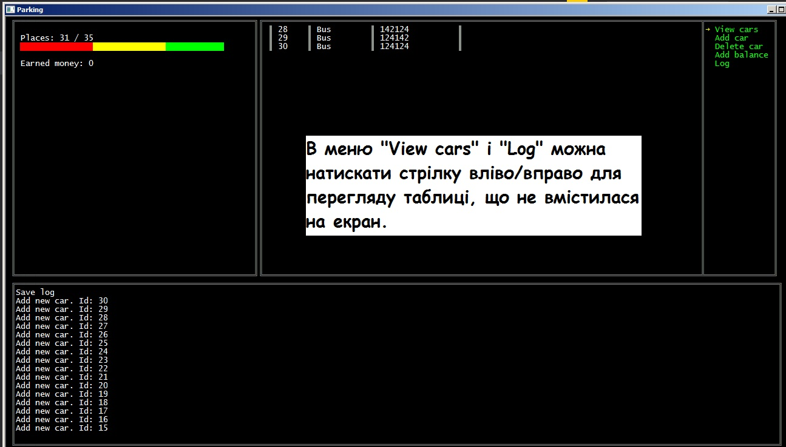

# CarParking
Тестове завдання в Binary Studio Academy'18

2nd stage • 2. C# Modern Features

Консольное приложение с пользовательским вводом (меню, форматированный вывод и т.д.), эмулирующее работу парковки.

## Керування:
* ↑, ↓ - Вибрати пункт меню
* ←, → - В пункті _View cars_ і _Log_ прогортати таблицю
* Tab - перемикати активний елемент
* Enter - вибрати активний елемент

## Фичи:
 * Перегляд інформації по транзакціях/автомобілях
 * Зчитування налаштувань з XML файлу
 * Гарний ASCII вивід

## Зроблено на
 * C#

