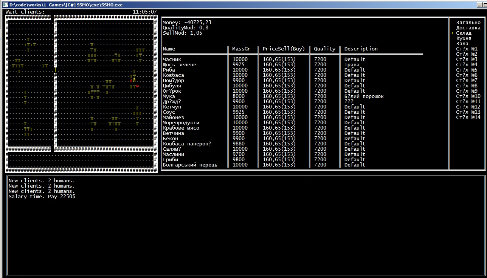
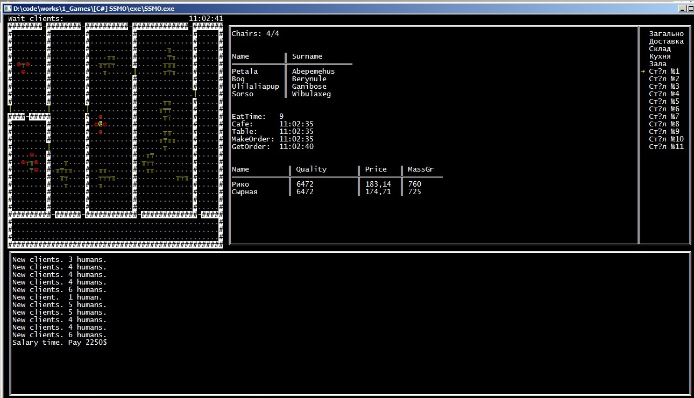
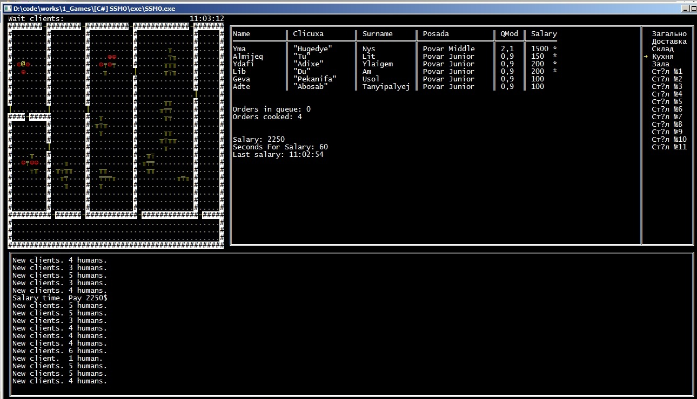

# Симулятор систем масового обслуговування(піцерія)
## Керування:
* ←, → - Вибрати пункт меню
* ↑, ↓ - В пункті _Доставка_ і _Склад_ прогортати таблицю

## Фичи:
 * Випадкова генерація будівлі
 * Випадкове створення інтерєру
 * Випадкова генерація імен
 * Гарний ASCII вивід
 * Перегляд інформації по доставці/складу/кухні/клієнтах

## Зроблено на
 * C#

