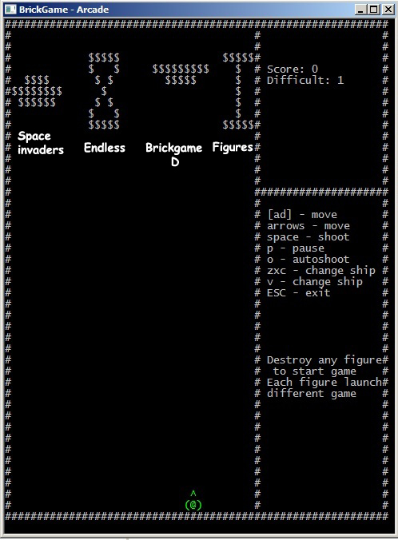
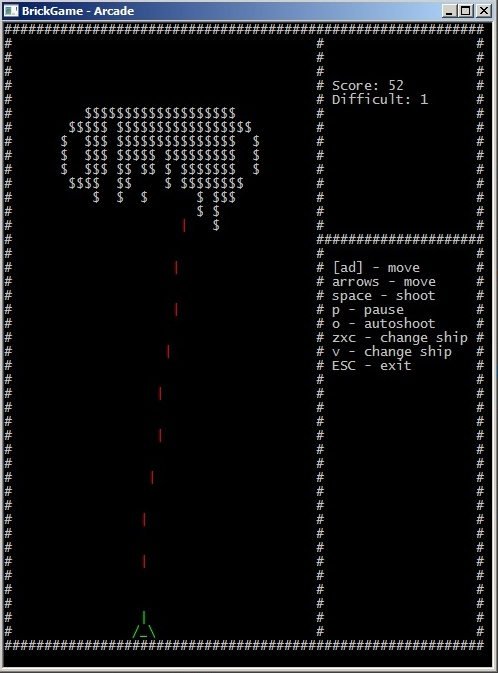
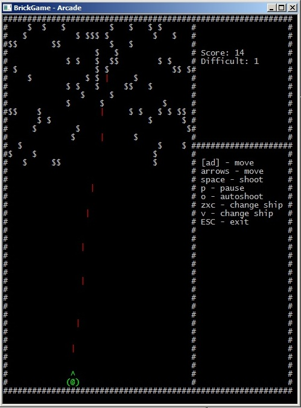
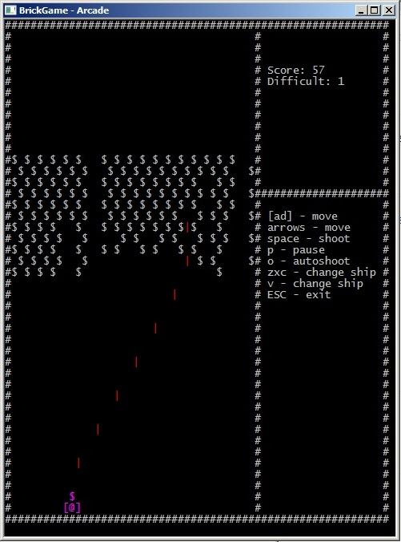

# Arcanoid from Brickgame
## Керування:
(← →) (ЛКМ ПКМ) (a d) - рух вліво вправо

Пробіл - стріляти

р - пауза

о - автоматична стрільба

v - Змінити колір корябля

z - Змінити ніс корябля

x - Змінити бік корябля

c - Змінити корпус корябля

## Фичи:
 * 2 ігрових режими(із 4 запланованих)
 	- [X] Знищення створених фігур
 	- [X] Нескінченна гра
	- [ ] Space invaders
	- [ ] Гра під буквою D з Brickgame
 * Гарний ASCII вивід
 * Меню прямо в грі

## Зроблено на
 * C++
 * Частина мого движка з underwater

