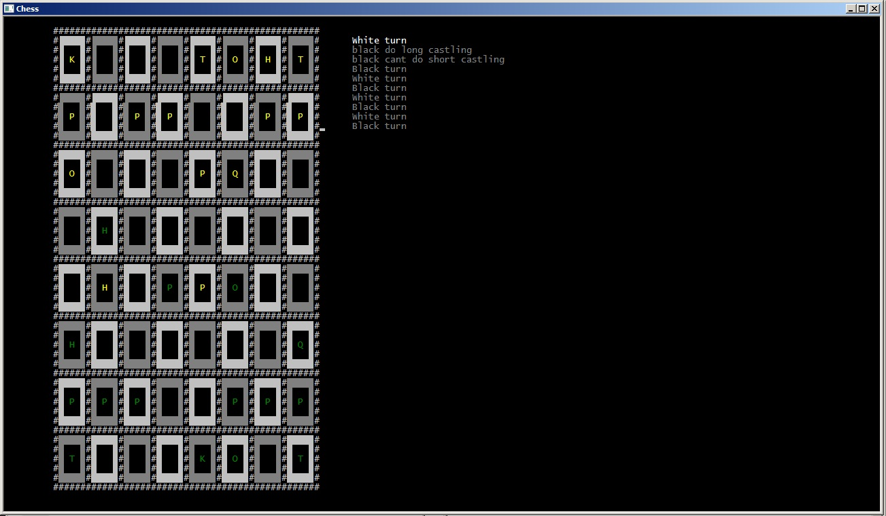

# Шахмати
## Керування:
 * Мишкою - вибір фігури. Вибрана фігура стає фіолетовою і потім можна вирішити куди їй ходити.
 * OOr - коротка рокировка
 * OOOr - довга рокировка

## Фичи:
 * Керування мишкою в консолі
 * Гарний ASCII вивід

## Зроблено на
 * C++
 * Частина мого движка з underwater
 * Власний .ini парсер

## Чити
 * suicide - програти гру
 * mat - мат білому
 * chag - шаг білому

