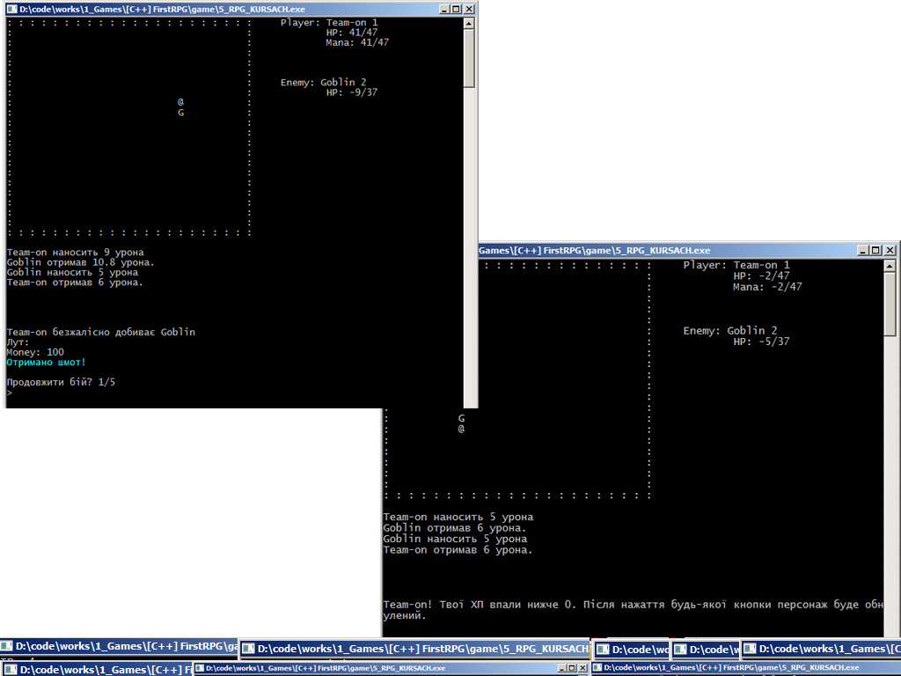
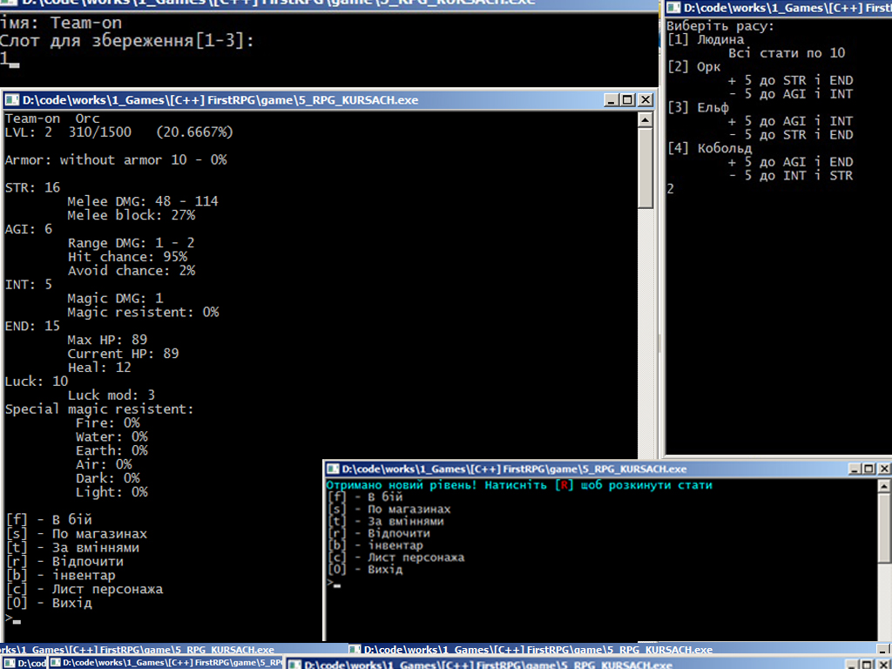

# РПГ

Проста текстова РПГ. Моя перша гра)

## Керування:
 * Вибір пунктів меню - прописати літеру в []. * В бою:
	* wasd - рух
	* wasd (до ворога) - атака
	* shift + wasd (до ворога) - силова атака

## Фичи:
 * В кращих традиціях текстовиx РПГ
	- [X] Збереження(3 слоти)
	- [X] Музика
	- [X] Система бою
	- [X] Система шмоток і інвентаря
	- [X] Стати і рівні
	- [ ] Магія
 * Вороги/Шмот/Магія зчитуються з файлу і вільно додаються

## Зроблено на
 * C++

