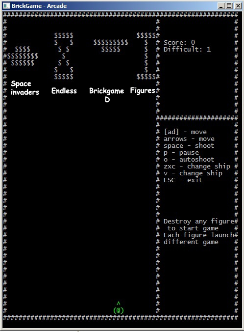
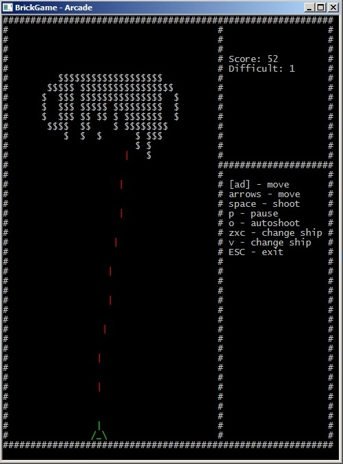
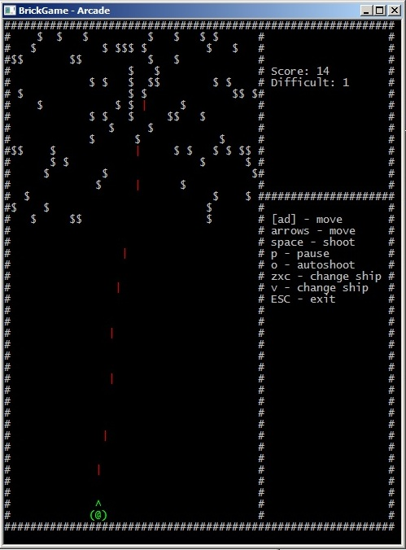
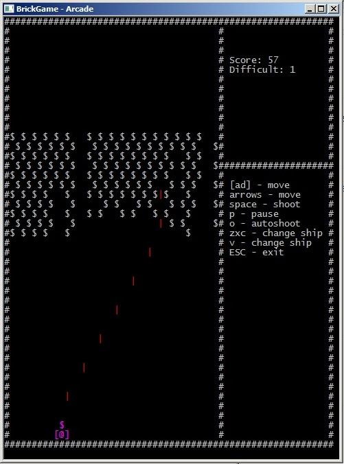

# Arcanoid from Brickgame

Attempt to write some games from Brickgame.

## Controls:
 * (← →) (LMB RMB) (a d) - move left/right
 * Space - shoot
 * р - pause
 * о - autoshoot on/off
 * Ship style:
	* v - Change ship color
	* z - Change ship cannpn
	* x - Change ship wings
	* c - Change ship body

## Features:
 * 2 game modes(from 4 planned)
 	- [X] Destroy figures
 	- [X] Endless game
	- [ ] Space invaders
	- [ ] Letter D game from Brickgame
 * Cute ASCII output
 * Ingame menu

## Made with:
 * C++
 * Underwater engine

