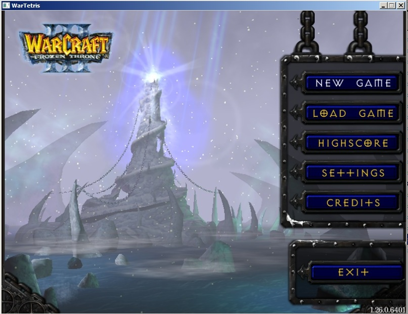
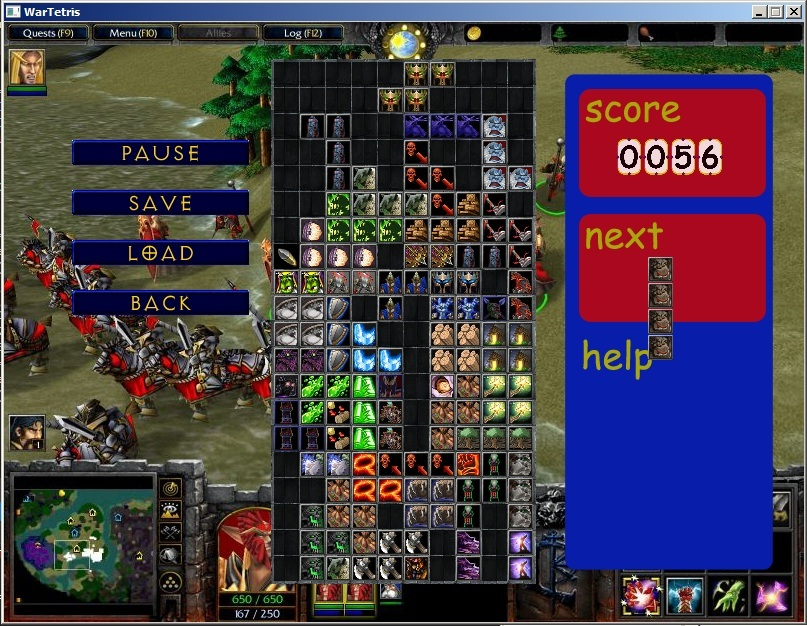

# Tetris

Test task for ABGames.

## Controls:
 * Ingame controls:
 	* (← →) - move piece left/right
 	* ↓ - fall faster
	* Space - turn
	* Buttons can be pressed by mouse
 * In menu:
	* (↑ ↓) - choose button
	* Space/Enter - press button
 * ESC - back

## Features:
 * Read pieces from .XML file
 * Original warcraft 3 style

## Made with:
 * C++
 * HGE16
 * tinyXml 1.0.1
 * Audiere 1.9.4 

