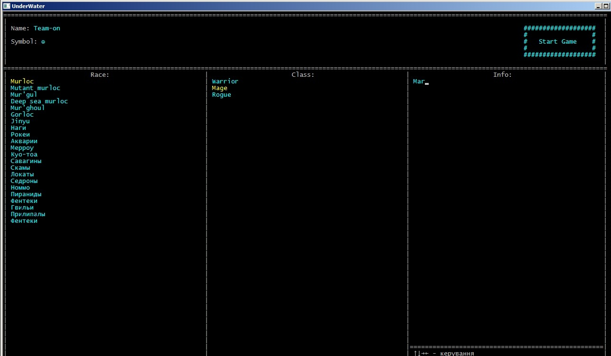
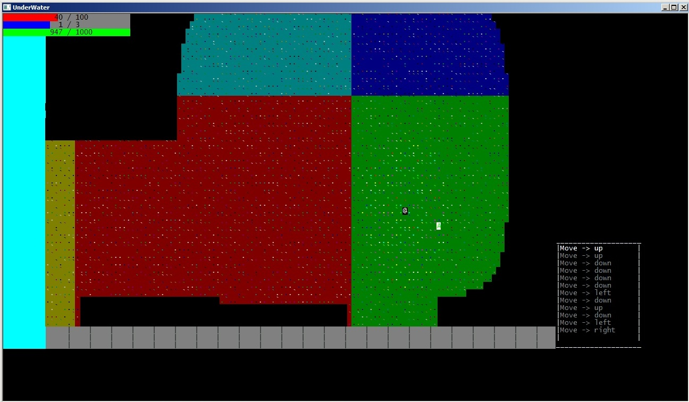
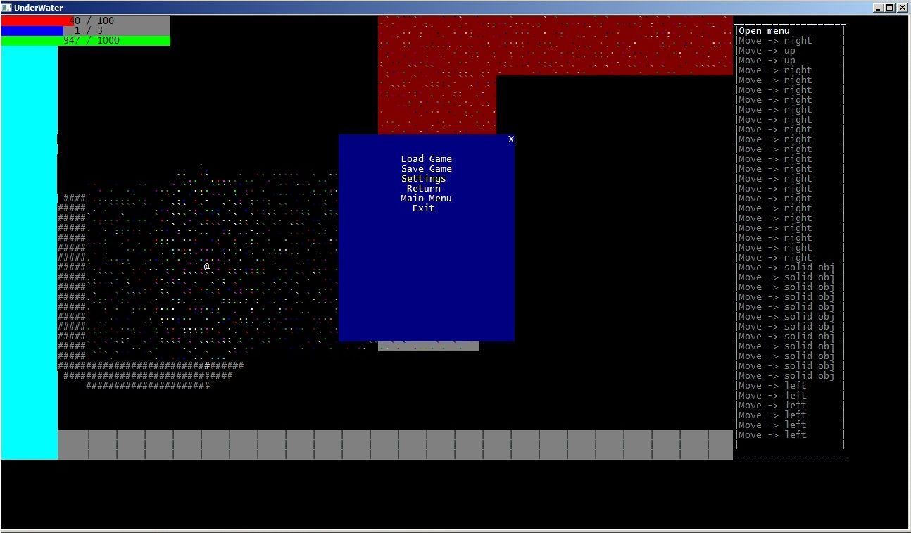

# Roguike
## Керування:
 * (← → ↑ ↓) - рух
 * Enter - вибір
 * В меню працює мишка

## Фичи:
 * Оптимізація виводу в консоль
 * Ввід мишкою в консоль
 * Як гру я це не закінчив, але частини движка використовується в інших іграх. А саме лог, ввід, вивід.
	

## Зроблено на
 * C++

