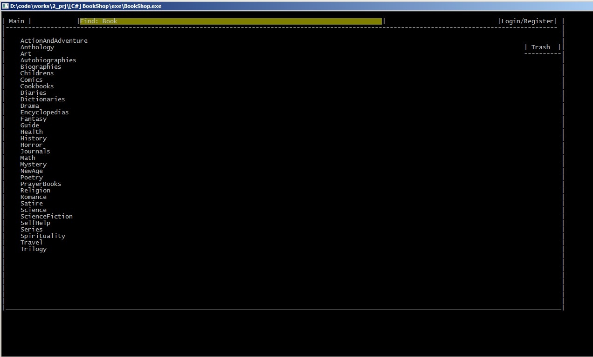
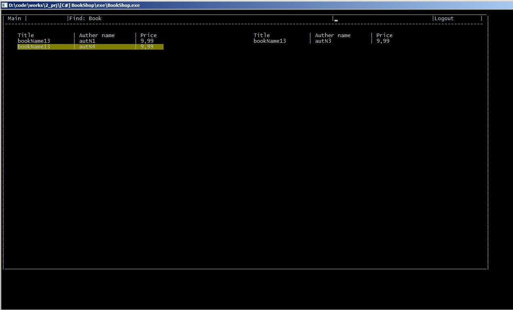
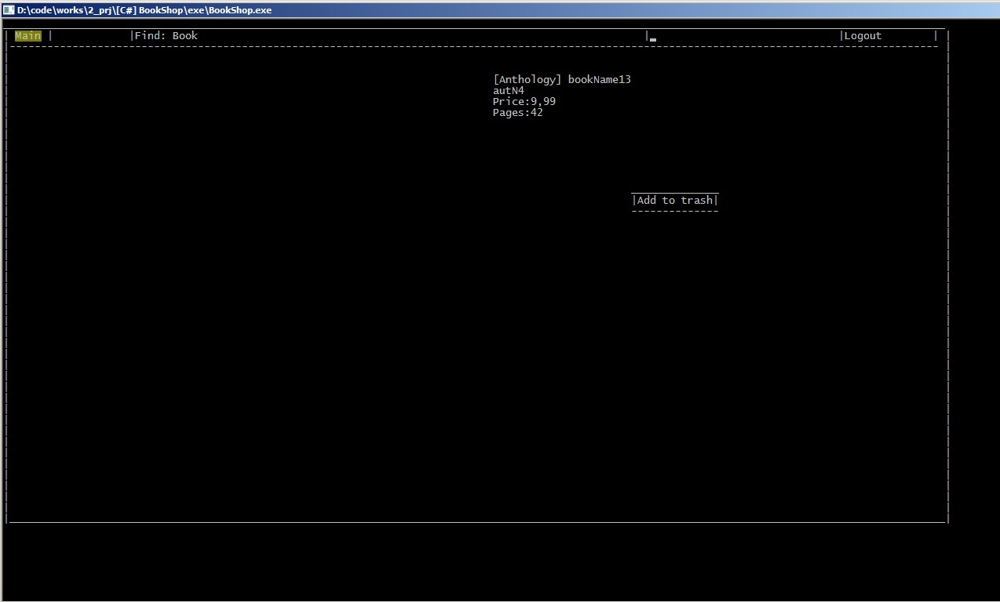

# Книжковий магазин

Книжковий магазин, по типу будь-якого онлайн магазину, але в консолі. Реалізована логіка корзини, профілів користувачів, складу, адміністрування.

Зроблено в команді з [ним](https://github.com/Gigi220).

## Керування:
* Page up/down - перехід по пунктах меню
* Enter - вибір підсвіченого пункту
* [, ] - змінювати значення Counter в корзині
* Backspace - стерти текст 

## Фичи:
 * Підтримка великої кількості користувачів
 * Гарний ASCII вивід
 * Власна бібліотека класів для виводу в ASCII, у стилі WindowsForms

## Зроблено на
 * C#

