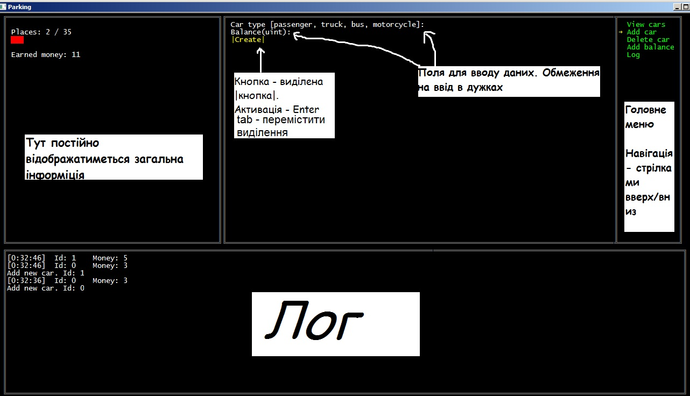
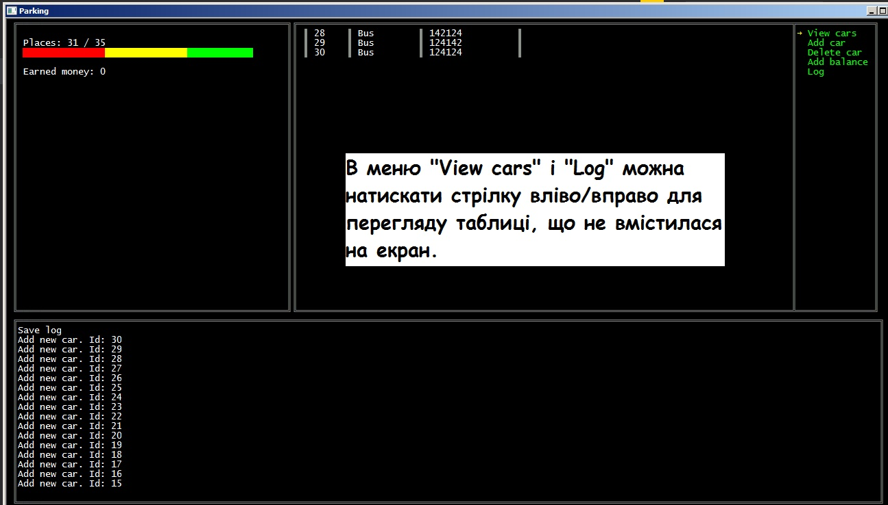

# CarParking
Test for Binary Studio Academy'18

2nd stage • 2. C# Modern Features

Console application with user input (menu, formatted output, etc.) that emulates parking.

## Controls:
* ↑, ↓ - Choose menu item
* ←, → - In _View cars_ and _Log_ прогортати scroll table
* Tab - change active element
* Enter - select active element

## Features:
 * View Transaction / Vehicle Information
 * Read configs from XML file
 * Cute ASCII output

## Made with:
 * C#

