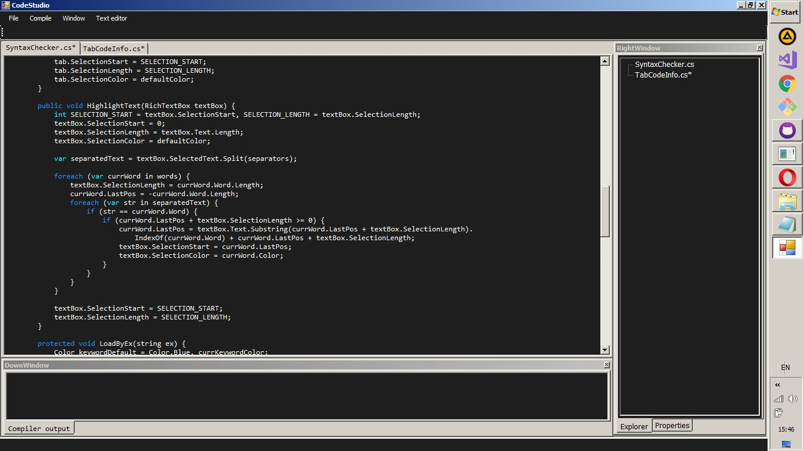
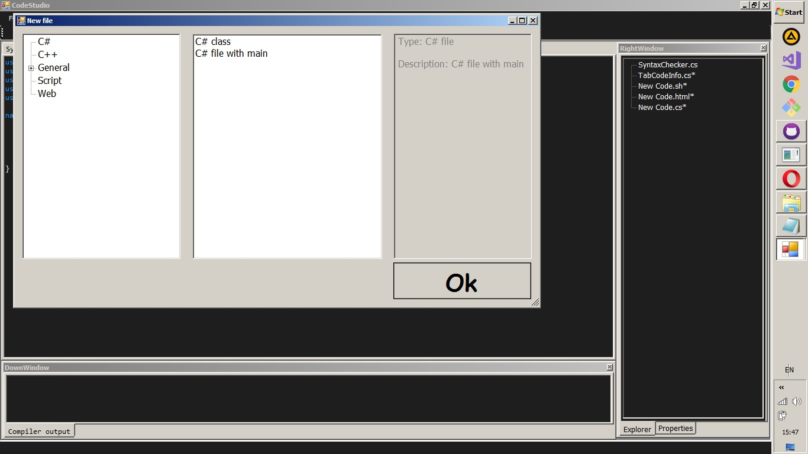
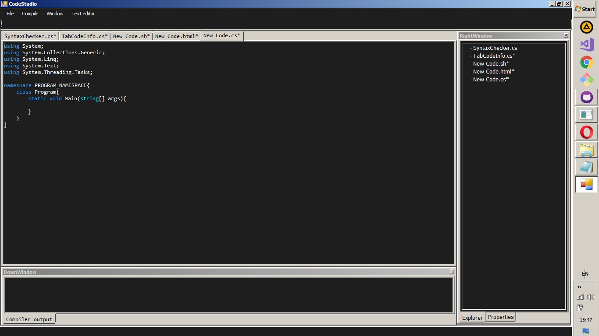

# IDE
 Пиши і компілюй код в одній програмі!

## Фичи:
 * Компіляція одразу в ide
	* Лише для C#
 * Можливість створення файлів на основі шаблонів.
	* Шаблони можна створювати самому
 * Підсвітка синтаксису
 	* Налаштування кольору і слів для підсвічування
 * Працює лише з 1-файловими проектами
 * Налаштування вигляду

## Зроблено на
 * С#
 * WPF

