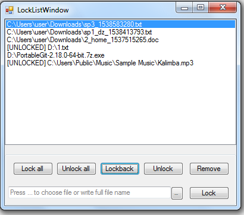

# FileLocker
 Блокує вибрані користувачем файли.

## Фичи:
 * Блокування вибраних файлів. Маніпуляція ними
 * Заборона *Диспечеру задач* знімати програму
 * Запуск програми в 1 екземплярі
 * Додавання програми в автозапуск

## Зроблено на
 * С#
 * Windows Forms
 * WinAPI

