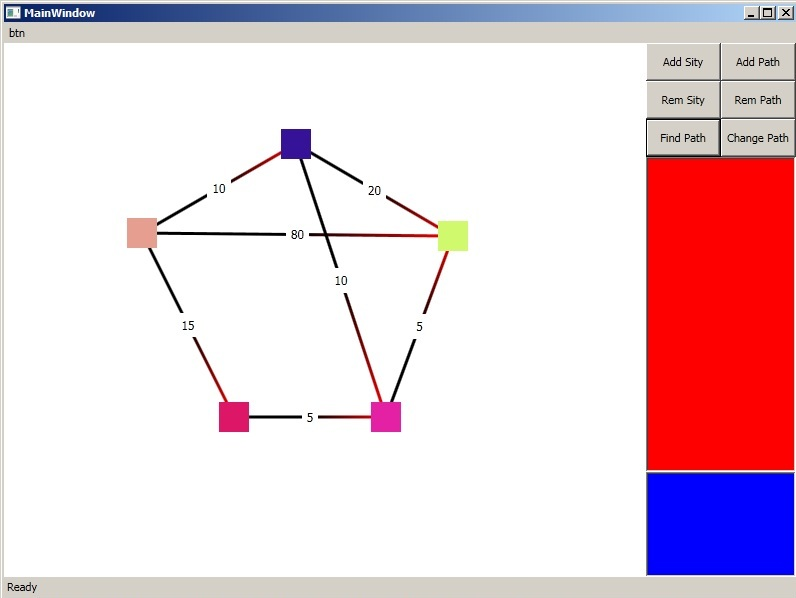
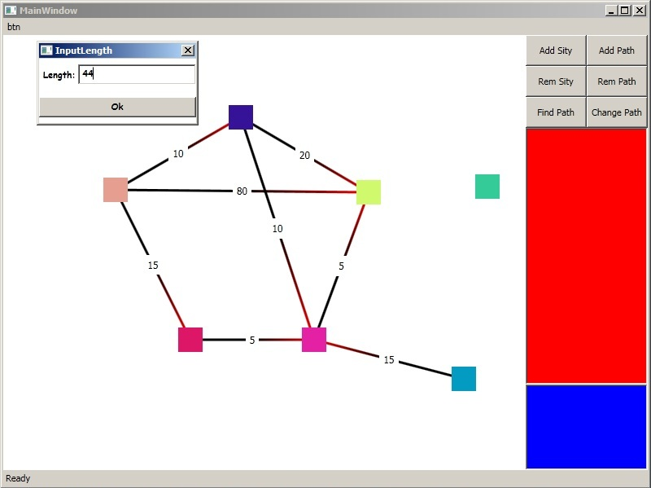

# Graph editor
 App for finding shortest distance between graphs and their rendering

## Features:
 * Add and remove graphs or paths
 * Move graphs
 * Fidn shortest way

## Made with:
 * С#
 * WPF

