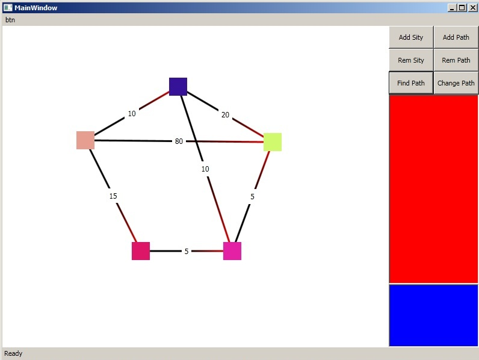
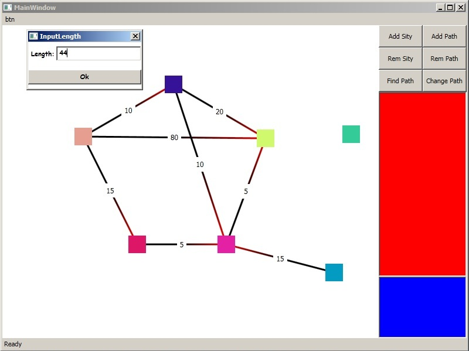

# Graph editor
 Програма для знаходження найкоротшої відстані між графами і їх візуалізації

## Фичи:
 * Додавати і видаляти графи та шляхи між ними.
 * Переміження графів по екрану
 * Знаходження найкоротшого шляху

## Зроблено на
 * С#
 * WPF

