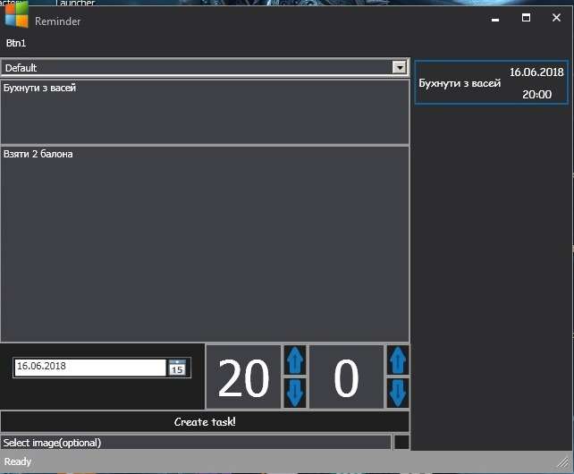
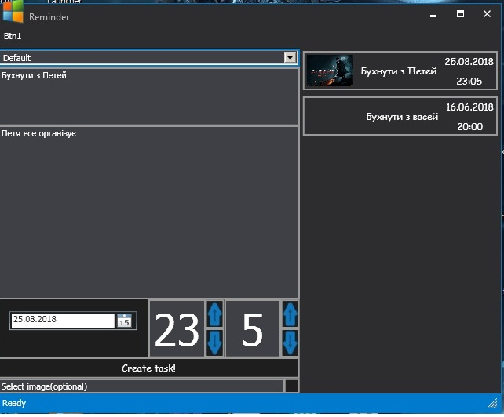
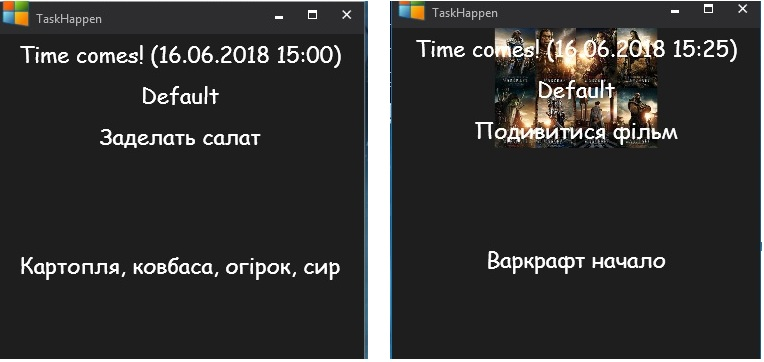

# Reminder
 Програма для запису і перегляду нагадувань.

## Фичи:
 * Коли приходить час, то нагадування спливе в правому нижньому кутку.
 * Створювати нагадування на основі вже існуючих
 * Додавати нагадуванню картинки

## Зроблено на
 * С#
 * WPF
 * https://github.com/D-Key/whosh - Стиль вікна

