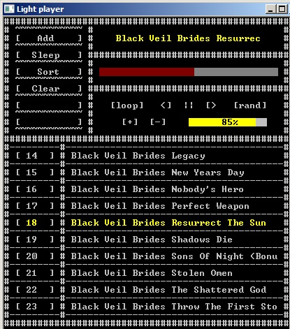

# AudioPL
 Простий і легкий консольний аудіо плеєр

## Фичи:
 * Керування мишкою в консолі
 * Гарний ASCII вивід
 * Програє mp3, ogg, wav
 * Таймер на виключення
 * Копіювання пісні на робочий стіл при натисненні по назві

## Зроблено на
 * C++
 * Audiere 1.9.4 
 * Частина мого движка з underwater
 
### Рекомендовані налаштування консолі:
  * Font: Raster Fonts 8x12
  * Size: 50x37

