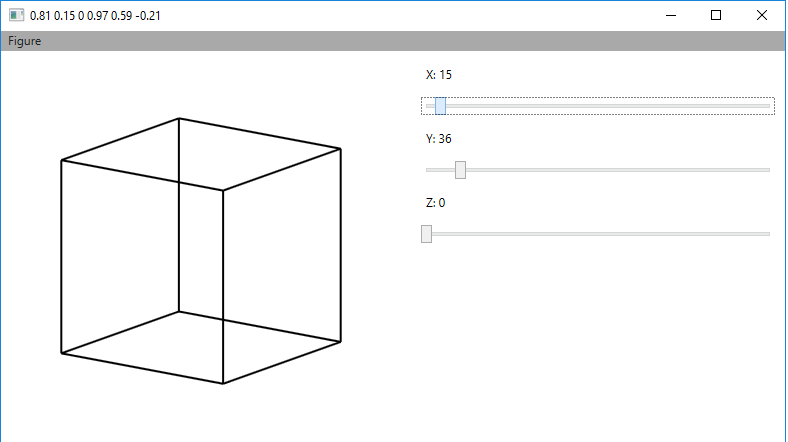
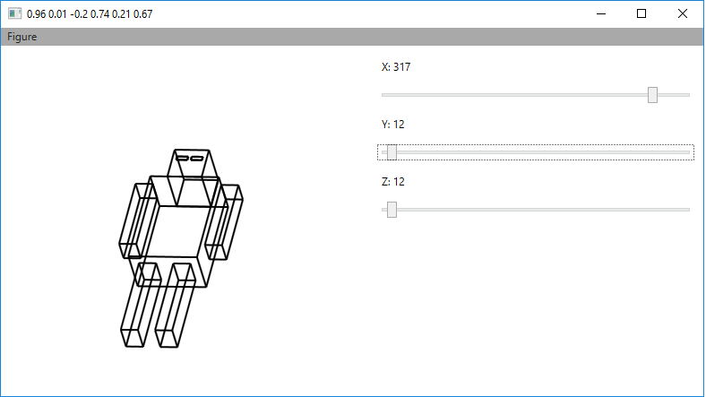

# Fake3D
 Draw 3D figures using 2D lines.

## API
 * **Point3D** - coord in 3 dimentions. Need to build any other figure.
 * **Line3D** - Line in 3 dimentions.
	* **static CalcValues(out double c1, out double q1, out double r1, out double c2, out double q2, out double r2, double a, double b, double c)** - calc coefficient for lines
	* **Recalc2DLine(double c1, double q1, double r1, double c2, double q2, double r2)** - use coefficient and return 3D line
 * **Cube3D** - Use 2 points to create parallelepiped
 
## Plan
 * Клас для коєфіцієнтів
 * Менеджер для ліній
 
## Made with
 * С#
 * WPF

